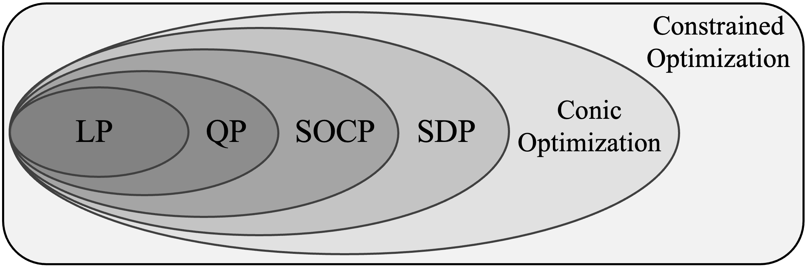
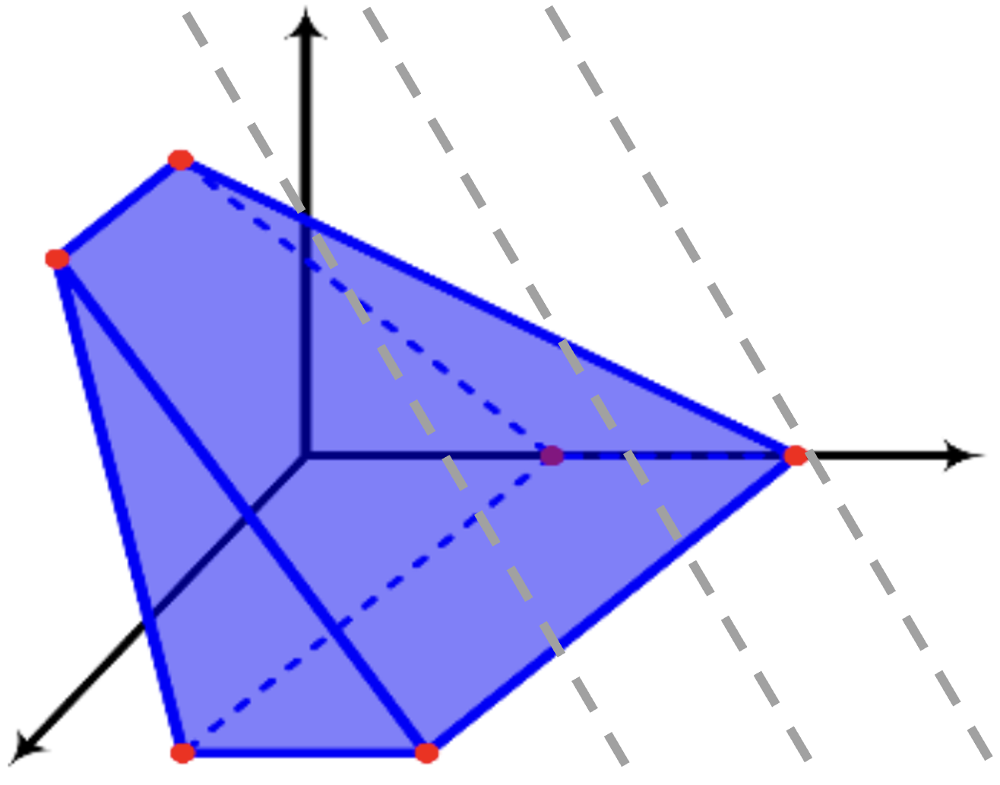
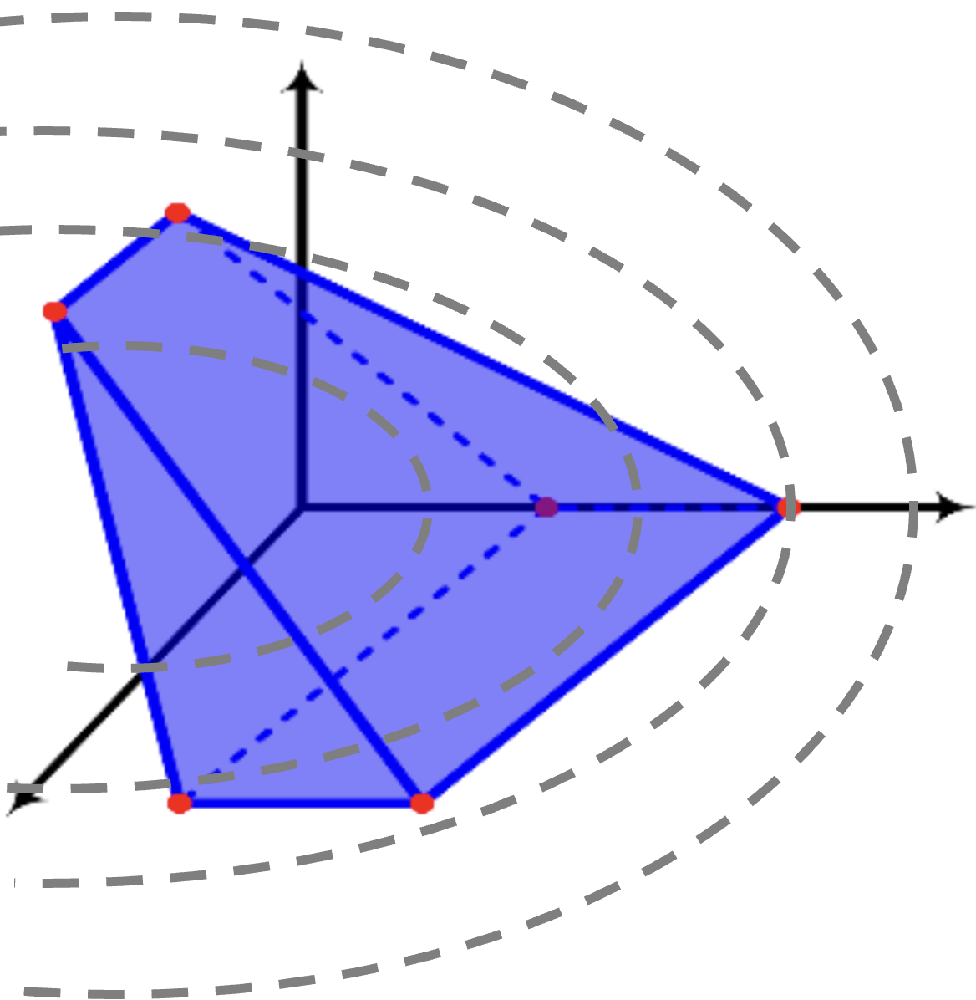
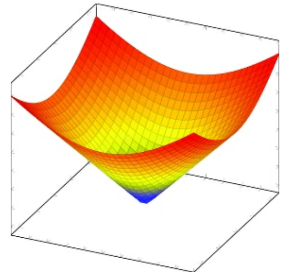
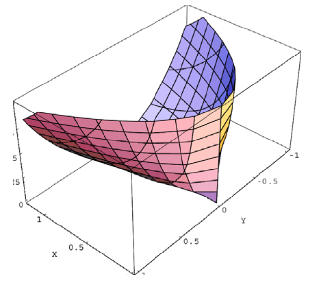
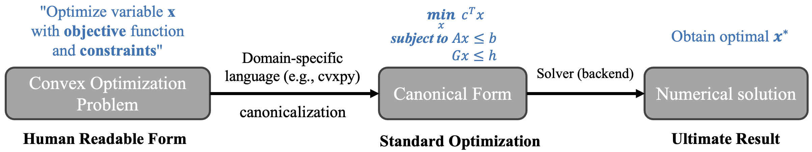
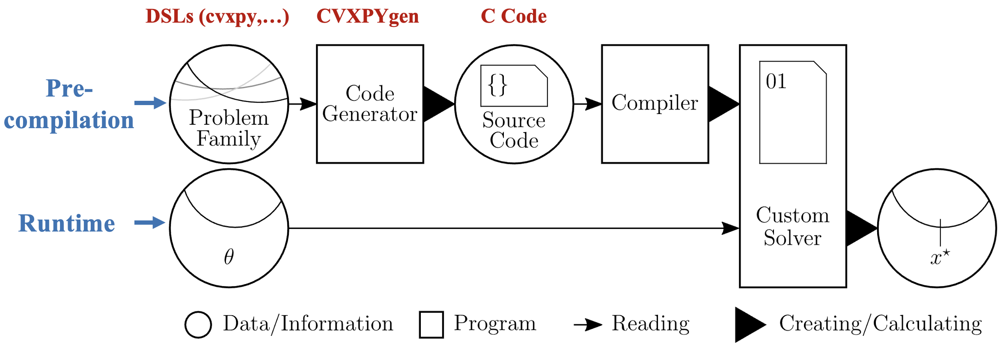

# ecvxcone

<!-- [](https://ubuntu.com/)
[](https://wiki.ros.org/foxy)
[](https://opensource.org/license/apache-2-0) -->


---

`ecvxcone` (**e**mbedded **CVX** for **cone** programming) is a lightweight solver tailored for embedded system use, which supports general conic optimization problems.

[cvxopt](https://github.com/cvxopt/cvxopt) is a Python-based optimization library that leverages C-based high-performance computation backends such as LAPACK and BLAS. In contrast, `ecvxcone` removes the Python API layer and re-implements the solver logic entirely in pure C, making it better suited for embedded and real-time applications. Its core conic solver is an implementation of the [Interior-Point Method](https://en.wikipedia.org/wiki/Interior-point_method). It further optimizes the canonicalization process for problem families to enhance real-time performance.


> [!NOTE]
> Currently this library supports the constraints in the linear form. The support for quadratic form of constraints may be added in the future version.

---

## Convex Optimization

### 📐 Conic Optimization

The mathematical formulation of a generalized cone linear program can be written as:

$$
\begin{aligned}
&\underset{x}{\text{minimize}} && \mathbf{c}^T x \\
&\text{subject to} && \mathbf{G}x + \mathbf{s} = \mathbf{h} \\
&&& \mathbf{A}x = \mathbf{b} \\
&&& \mathbf{s} \succeq 0
\end{aligned}
$$

with $\mathbf{s}$ being the slack variable. An overview of Conic Optimization problem is shown below:

<p align="center">
  
  <br><b>Figure. Overview of Conic Optimization</b>
</p>

| Problem | Representation | Conic Type | Objective | Constraints | Figure |
|:---:|:---:|:---:|:---:|:---:|:---:|
| `LP`<br>(Linear Programming) | $\min_{\mathbf{x}} \ \mathbf{c}^\top\mathbf{x} + d$ <br> s.t. $\mathbf{A}\mathbf{x}\le\mathbf{b}$, <br> $\mathbf{G}\mathbf{x}=\mathbf{h}$ | Nonnegative orthant cone $\mathbb{R}^n_+$ | Linear | Polyhedron (half-space intersection) |  |
| `QP`<br>(Quadratic Programming) | $\min_{\mathbf{x}} \ \frac{1}{2}\mathbf{x}^\top\mathbf{Q}\mathbf{x} + \mathbf{p}^\top\mathbf{x} + r$ <br> s.t. $\mathbf{A}\mathbf{x} \le \mathbf{b}$ <br> $\mathbf{G}\mathbf{x} = \mathbf{h}$ | Nonnegative orthant cone $\mathbb{R}^n_+$ | Quadratic (convex if $Q \succeq 0$) | Polyhedral set |  |
| `SOCP`<br>(Second-Order Conic Programming) | $\min_{\mathbf{x}} \ \mathbf{f}^\top\mathbf{x}$ <br> s.t. $\|\|\mathbf{A}_i\mathbf{x} + \mathbf{b}_i\|\|_2 \le \mathbf{c}_i^\top\mathbf{x}$ <br> $\ + d_i, \ i=1,\dots,n$ <br> $\mathbf{G}\mathbf{x} = \mathbf{h}$ | Second-order (Lorentz) cone $\mathcal{Q}^n_+$ | Linear | Intersection of second-order cones and affine sets |  |
| `SDP`<br>(Semi-Definite Programming) | $\min_{\mathbf{x}} \ \mathbf{c}^\top\mathbf{x}$ <br> s.t. $\mathbf{x}_1\mathbf{A}_1^i + \dots + \mathbf{x}_n\mathbf{A}_1^n $<br> $\ + \mathbf{B}^i \preceq 0,\ i=1,\dots,n$ <br> $\mathbf{G}\mathbf{x} = \mathbf{h}$ | Positive semidefinite cone $\mathbb{S}^n_+$ | Linear | Matrix PSD constraint (convex cone) |  |

### 🔄 Solving Pipeline

The typical workflow for solving an optimization problem consists of:

* **Canonicalization**: Using domain-specific languages (DSLs) to transform a problem formulated under disciplined convex programming (DCP) rules into a canonical (standardized mathematical) form

* **Solver Execution**: Applying an appropriate solver to the canonical problem (e.g., LP, QP, SOCP, SDP).

<p align="center">
  
  <br><b>Figure. A Typical Workflow for Solving a Convex Optimization Problem</b>
</p>

### 📏 Disciplined Parametrized Programming (DPP)

In a problem family, the optimization problem’s structure remains fixed, with only certain parameters changing. Most DSLs (e.g., CVXPY) recompile the problem into a canonical form for each solve, which can be unnecessary and costly—especially for embedded systems with hard real-time constraints. [CVXPYgen](https://github.com/cvxgrp/cvxpygen) addresses this by precompiling the Python-based canonicalization into C code, enabling faster execution for repeated solves.

<p align="center">
  
  <br><b>Figure. Precompilation for a Problem Family with CVXPYgen</b>
</p>

---

## ⚖️ Solver Comparison

The table below compares popular solvers based on their features. `DPP` indicates whether the solver supports precompilation of a problem family for embedded deployment.

<table>
  <tr align="center">
    <th rowspan="2">Solver</th>
    <th rowspan="2">Open<br>Source</th>
    <th colspan="4">Problem Type Support</th>
    <th rowspan="2">Language<br>Support</th>
    <th rowspan="2">DPP</th>
    <th rowspan="2">Stability</th>
    <th rowspan="2">License</th>
  </tr>
  <tr align="center">
    <th>LP</th>
    <th>QP</th>
    <th>SOCP</th>
    <th>SDP</th>
  </tr>
  <tr align="center">
    <td><a href="https://github.com/coin-or/Clp" target="_blank">CLP</a></td>
    <td>Yes</td>
    <td>✅</td><td>❌</td><td>❌</td><td>❌</td>
    <td>C++, Python</td>
    <td>❌</td>
    <td><span>🟢 High</span></td>
    <td>EPL-2.0</td>
  </tr>
  <tr align="center">
    <td><a href="https://osqp.org/" target="_blank">OSQP</a></td>
    <td>Yes</td>
    <td>❌</td><td>✅</td><td>❌</td><td>❌</td>
    <td>C, Python, MATLAB</td>
    <td>✅</td>
    <td><span>🟢 High</span></td>
    <td>Apache-2.0</td>
  </tr>
  <tr align="center">
    <td><a href="https://github.com/coin-or/qpOASES" target="_blank">qpOASES</a></td>
    <td>Yes</td>
    <td>❌</td><td>✅</td><td>❌</td><td>❌</td>
    <td>C++, Python</td>
    <td>✅</td>
    <td><span>🟢 High</span></td>
    <td>LGPL-2.1</td>
  </tr>
  <tr align="center">
    <td><a href="https://highs.dev/" target="_blank">HiGHS</a></td>
    <td>Yes</td>
    <td>✅</td><td>✅</td><td>❌</td><td>❌</td>
    <td>C++, Python</td>
    <td>❌</td>
    <td><span>🟢 High</span></td>
    <td>MIT</td>
  </tr>
  <tr align="center">
    <td><a href="http://sdpa.sourceforge.net/" target="_blank">SDPA</a></td>
    <td>Yes</td>
    <td>❌</td><td>❌</td><td>❌</td><td>✅</td>
    <td>C++, MATLAB</td>
    <td>❌</td>
    <td><span>🟡&nbsp;Medium</span></td>
    <td>BSD</td>
  </tr>
  <tr align="center">
    <td><a href="https://github.com/embotech/ecos" target="_blank">ECOS</a></td>
    <td>Yes</td>
    <td>✅</td><td>✅</td><td>✅</td><td>❌</td>
    <td>C, Python</td>
    <td>✅</td>
    <td><span>🟡&nbsp;Medium</span></td>
    <td>GPLv3</td>
  </tr>
  <tr align="center">
    <td><a href="https://github.com/cvxgrp/scs" target="_blank">SCS</a></td>
    <td>Yes</td>
    <td>✅</td><td>✅</td><td>✅</td><td>✅</td>
    <td>C, Python, MATLAB</td>
    <td>✅</td>
    <td><span>🔴 Low</span></td>
    <td>MIT</td>
  </tr>
  <tr align="center">
    <td><a href="https://www.mosek.com/" target="_blank">MOSEK</a></td>
    <td>No</td>
    <td>✅</td><td>✅</td><td>✅</td><td>✅</td>
    <td>C, Java, Python, R, MATLAB</td>
    <td>❌</td>
    <td><span>🟢 High</span></td>
    <td>Commercial (Academic Free)</td>
  </tr>
  <tr align="center">
    <td><a href="https://github.com/cvxopt/cvxopt" target="_blank">CVXOPT</a></td>
    <td>Yes</td>
    <td>✅</td><td>✅</td><td>✅</td><td>✅</td>
    <td>Python</td>
    <td>❌</td>
    <td><span>🟢 High</span></td>
    <td>GPLv3</td>
  </tr>
  <tr align="center">
    <td><a href="#" target="_blank"><b>ecvxcone</b></a></td>
    <td>Yes</td>
    <td>✅</td><td>⏳</td><td>✅</td><td>✅</td>
    <td>C, C++</td>
    <td>✅</td>
    <td><span>🟢 High</span></td>
    <td>Apache-2.0</td>
  </tr>
</table>

---

## 💡 User Guide

### ⚙️ Dependencies

* LAPACK (Linear Algebra PACKage)
* BLAS (Basic Linear Algebra Subprograms)

### 🔨 Setup

1. Clone this repository:

```bash
git clone https://github.com/Charlescai123/ecvxcone.git
```

2. Create and activate a Conda environment:

```bash
conda create --name ecvxcone python==3.10.6
conda activate ecvxcone
```

3. Install Python dependencies:
```bash
pip install cvxpy cvxopt
```

4. Install CVXPYgen:
```bash
cd ecvxcone/third_party/cvxpygen
pip install -e .
```

### 🤖 Generate C Code

1. Write your DDP-compliant python code in `ecvxcone/third_party/cvxpygen/ecvxcone_cpg.py`

2. Generate the embedded C code:
```bash
cd ecvxcone/third_party/cvxpygen && python ecvxcone_cpg.py
```

3. Write your real-time parameter update logic in C code, an example is provided in `ecvxcone/examples/lmi.c`.

```mermaid
graph LR
    subgraph PY["In DDP-compliant (Python)"]
        A1["A_param"]
        A2["B_param"]
        A3["zz_param"]
    end

    subgraph CC["In generated C code"]
        B1["cpg_update_A()"]
        B2["cpg_update_B()"]
        B3["cpg_update_zz()"]
    end

    A1 --> B1
    A2 --> B2
    A3 --> B3

    style A1 fill:#4A90E2,stroke:#2C3E50,stroke-width:2px,color:#fff,rx:10,ry:10
    style A2 fill:#4A90E2,stroke:#2C3E50,stroke-width:2px,color:#fff,rx:10,ry:10
    style A3 fill:#4A90E2,stroke:#2C3E50,stroke-width:2px,color:#fff,rx:10,ry:10

    style B1 fill:#1e1e1e,stroke:#ffffff,color
    style B2 fill:#1e1e1e,stroke:#ffffff,color
    style B3 fill:#1e1e1e,stroke:#ffffff,color
```



### 🛠️ Build

1. Add configuration to `ecvxcone/CMakeLists.txt` or use the example `lmi.c`

2. Build the project:
```bash
cd ecvxcone && mkdir build && cd build
cmake .. && make -j$(nproc)
```

> **Tips:** Enable unit tests for the solver with cmake command `cmake -DBUILD_TESTS=ON ..`

3. Run the example with `taskset`:
```bash
taskset -c 1 ./lmi
```

> [!NOTE]
> A practical ROS 2 implementation for robotics use—featuring a physical model-based safety controller design, is available in  [phy_teacher_ros2](https://github.com/Charlescai123/phy_teacher_ros2).

### 🕒 Runtime Validation

The table below presents results for running the example `Linear Matrix Inequalities` on different embedded platforms, comparing execution time and memory usage between the original Python solver and the C-based `ecvxcone` implementation.


<table>
  <tr align="center">
    <th rowspan="2">Hardware Platforms</th>
    <th colspan="3">CPU</th>
    <th colspan="2">Runtime&nbsp;Memory&nbsp;Usage</th>
    <th colspan="2">Solve Time</th>
  </tr>
  <tr align="center">
    <th>Arch</th>
    <th>Core</th>
    <th>Frequency</th>
    <th>Python</th>
    <th>C</th>
    <th>Python</th>
    <th>C</th>
  </tr>
  <tr align="center">
    <td>Dell XPS 8960 Desktop</td>
    <td>x86/64</td>
    <td>32</td>
    <td>5.4&nbsp;GHz</td>
    <td><nobr>485&nbsp;MB</nobr></td>
    <td><b><nobr>9.87&nbsp;MB</nobr></b></td>
    <td><nobr>49.15&nbsp;ms</nobr></td>
    <td><b><nobr>13.81&nbsp;ms</nobr></b></td>
  </tr>
  <tr align="center">
    <td>Intel GEEKOM XT13 Pro Mini</td>
    <td>x86/64</td>
    <td>20</td>
    <td>4.7&nbsp;GHz</td>
    <td><nobr>443&nbsp;MB</nobr></td>
    <td><b><nobr>7.32&nbsp;MB</nobr></b></td>
    <td><nobr>61.76&nbsp;ms</nobr></td>
    <td><b><nobr>33.26&nbsp;ms</nobr></b></td>
  </tr>
  <tr align="center">
    <td>NVIDIA Jetson AGX Orin</td>
    <td>ARM64</td>
    <td>12</td>
    <td>2.2&nbsp;GHz</td>
    <td><nobr>423&nbsp;MB</nobr></td>
    <td><b><nobr>8.16&nbsp;MB</nobr></b></td>
    <td><nobr>137.54&nbsp;ms</nobr></td>
    <td><b><nobr>35.73&nbsp;ms</nobr></b></td>
  </tr>
  <tr align="center">
    <td>Raspberry Pi 4 Model B</td>
    <td>ARM64</td>
    <td>4</td>
    <td>1.5&nbsp;GHz</td>
    <td><nobr>436&nbsp;MB</nobr></td>
    <td><b><nobr>8.21&nbsp;MB</nobr></b></td>
    <td><nobr>509.41&nbsp;ms</nobr></td>
    <td><b><nobr>149.87&nbsp;ms</nobr></b></td>
  </tr>
</table>


## 🏷️ Misc

### 👁️ Vision

With the growing adoption of machine learning and optimization at the edge, we envision an optimization toolchain that can run efficiently on devices with limited computational resources, delivering real-time performance in those resource-constrained environments.

In addition, there remains a gap between academic research and industrial deployment. Many optimization algorithms stay confined to theory, limited by hardware constraints and the lack of practical, open-source implementations. This repository aspires to bridge that gap—empowering both academic exploration and real-world deployment, while fostering closer collaboration between research and industry.

### 🚀 Applications

* **Control Theory:** Safety Controller Design [[4]](#-references), Decentralized Control and Optimization [[5]](#-references)
* **Trustworthy AI:** Robustness Certification [[6]](#-references), Neural Network Verification [[7]](#-references), Fairness-Aware ML [[8]](#-references)
* **Robotics Systems:** Obstacle Avoidance [[9]](#-references), Pose Estimation [[10]](#-references), Grasping & Force Optimization [[11]](#-references)

### 🤝 Contributing

We welcome contributions from developers to add new optimization algorithms and expand hardware validation for demanding real-time embedded applications.

---


## 📝 References

[1] Lieven Vandenberghe. Conic Programming. Department of Electrical and Computer Engineering, UCLA. Available at: https://www.seas.ucla.edu/~vandenbe/publications/coneprog.pdf

[2] Martin S. Andersen and Lieven Vandenberghe. Introduction to Mathematical Optimization. Unpublished manuscript. Available at: https://www.seas.ucla.edu/~vandenbe/publications/mlbook.pdf

[3] J. Nocedal and S. J. Wright, Numerical Optimization, 2nd ed. New York, NY, USA: Springer, 2006.


[4] Cai, Yihao, Yanbing Mao, Lui Sha, Hongpeng Cao, and Marco Caccamo. "Runtime Learning Machine." ACM Transactions on Cyber-Physical Systems.

[5] Falsone, Alessandro, Kostas Margellos, and Maria Prandini. "A decentralized approach to multi-agent MILPs: finite-time feasibility and performance guarantees." Automatica 103 (2019): 141-150.

[6] Li, Linyi, Tao Xie, and Bo Li. "Sok: Certified robustness for deep neural networks." 2023 IEEE symposium on security and privacy (SP). IEEE, 2023.

[7] Cotter, Andrew, et al. "Optimization with non-differentiable constraints with applications to fairness, recall, churn, and other goals." Journal of Machine Learning Research 20.172 (2019): 1-59.

[8] Dathathri, Sumanth, et al. "Enabling certification of verification-agnostic networks via memory-efficient semidefinite programming." Advances in Neural Information Processing Systems 33 (2020): 5318-5331.

[9] Deits, Robin & Tedrake, Russ. (2015). Computing Large Convex Regions of Obstacle-Free Space Through Semidefinite Programming. Springer Tracts in Advanced Robotics. 107. 109-124. 10.1007/978-3-319-16595-0_7

[10] Rosen, David M., et al. "SE-Sync: A certifiably correct algorithm for synchronization over the special Euclidean group." The International Journal of Robotics Research 38.2-3 (2019): 95-125.

[11] Dai, Hongkai & Majumdar, Anirudha & Tedrake, Russ. (2015). Synthesis and Optimization of Force Closure Grasps via Sequential Semidefinite Programming. 

---

## 🎉 Acknowledgments

- [cvxopt](https://github.com/cvxopt/cvxopt): Base references for implementation of cone programming.
- [cvxpygen](https://github.com/cvxgrp/cvxpygen): Some base codes for modeling DPP-compliant problem.